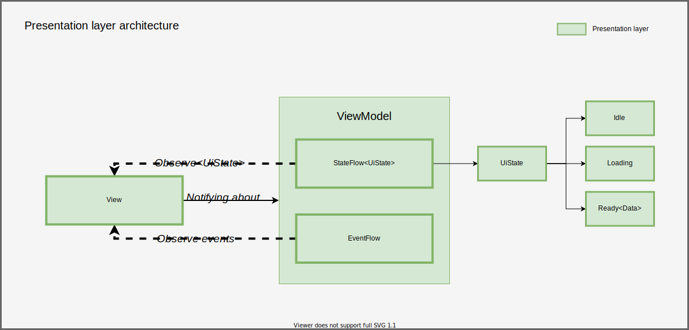

# The final task is only a set of requirements! Feel free to improvise!

You can implement anything, it's totally up to you. Working in a team is prohibited.

### Requirements:
- Clean Architecture should be used on the app level. The code suould be divided to data, domain and presentation layers. See the example with data flow below:

- MVVM/MVI architecure should be used on presentation layer. On presentation level we are working with UI-level/Domain-level models, data layer models are prohoboted. See the example below:

- Kotlin Coroutines should be used for async/concurrent operations.

- Coroutines Flow should be used instead of LiveData on Presentation layer.

- Dependency Injection should be implemented using Dagger/Hilt.

- For navigation Jetpack Navigation component should be used.

- App should support dark and light themes and have settings screen.

- All ViewModels have to be covered by unit tests

## Evaluation criteria
Before the deadline, every student have to make a short(up to 10 minutes) recording of app presentation in **English**. Presentation should contain information about the idea of the app, used technologies and a brief demo of the main functionality.

The following message should be sent to the #final-task discord channel:

- Name: Name Surname
- Location < location e.g. Minsk, Belarus >
- Discord: < discord nick >
- Github: < github nick >
- Mentor: Name Surname
- App: < link to the github repo >
- Demo: < link to the recorded video >
